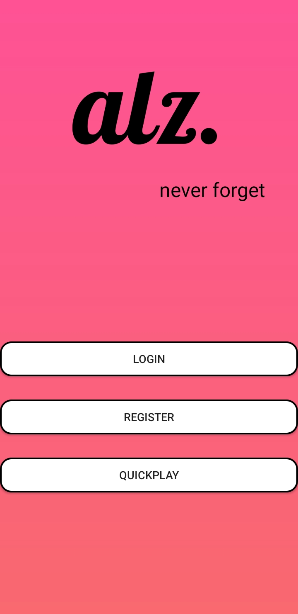
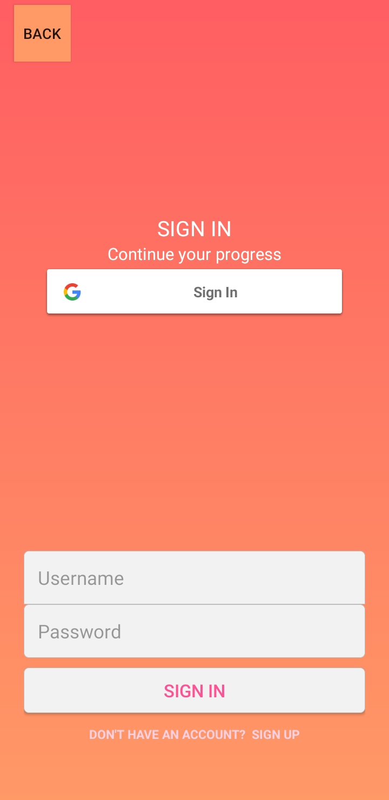
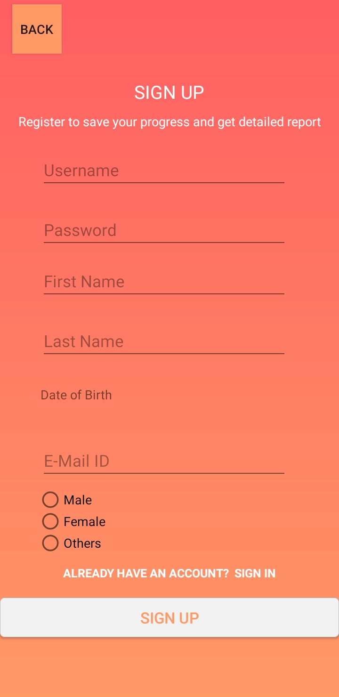
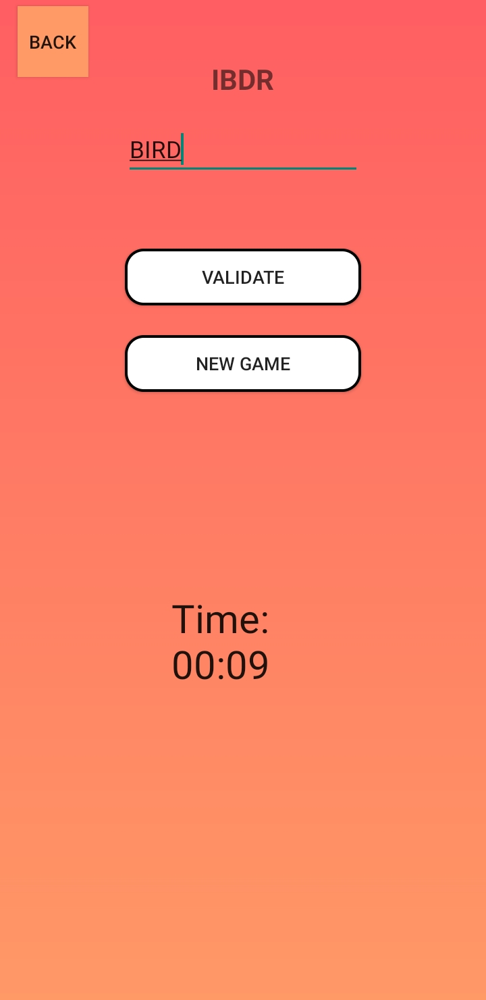
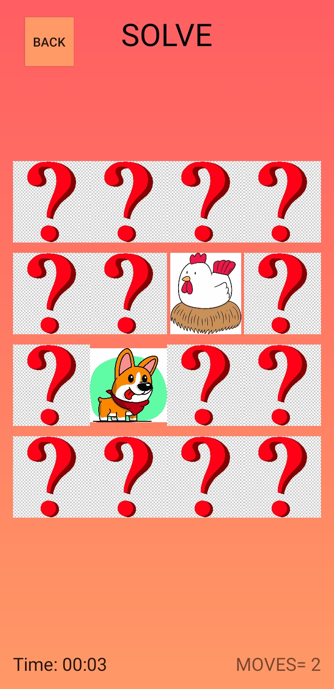
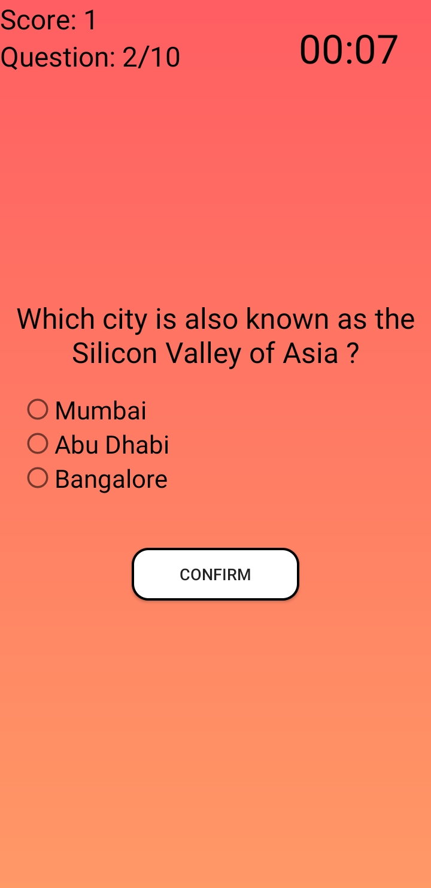

# alzapp

An Android Application that is intended to be a guiding tool for the early detection of [Alzheimer's disease](https://www.alz.org/alzheimer_s_dementia).

It is currently an **ongoing Project** consists of various games and word puzzles encompassed with simple UI to help people understand their mental condition to decide whether to consult a doctor.

Ways to use the Application

- Cloning the repository and makign an APK to be run on your android device.
- By installing the given APK (Coming Soon)

## Screenshots

          

